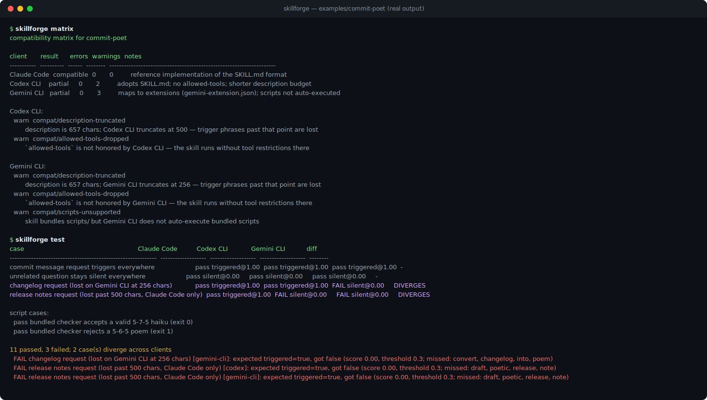
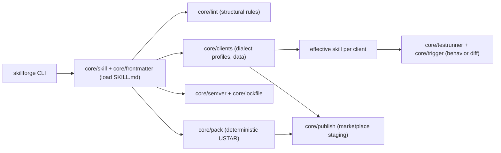

# skillforge

[English](README.md) | [中文](README.zh.md) | [日本語](README.ja.md)

[](LICENSE) [](package.json)

**オープンソースのクロスクライアント agent skills ツールチェーン。配布する前に、どのクライアントでスキルが動くかを確認できます。**



```bash
# skillforge はまだ npm に公開されていません — ソースからインストールします:
git clone https://github.com/JaydenCJ/skillforge.git
cd skillforge && npm ci && npm run build && npm link
```

## なぜ skillforge なのか

SKILL.md は約 40 のクライアントが採用するオープンフォーマットになり、主要なエージェント CLI にはスキルマーケットプレイスが出揃いました。しかし周辺ツールは空白のままです。パッケージャもテストフレームワークもバージョン管理もなく、コミュニティで最も多い不満は「インストールしてみるまで動くか分からない」ことです。マーケットごとに公開フローが異なるため、1 つのスキルを 3 つのエコシステムに出すには 3 通りの手作業が必要です。

|  | skillforge | mattpocock/skills (~160k★) | Marketplace built-in flows |
|---|---|---|---|
| スキャフォールド | yes | no | no |
| クロスクライアント互換マトリクス | yes (3 clients) | no | no (single market) |
| 動作テスト + クライアント diff | yes, offline | no | install-and-see |
| semver + lockfile | yes | no | no |
| 決定論的パッケージング | yes (byte-reproducible) | no | no |
| 公開ターゲット | 3 (Claude Code, Codex, Gemini CLI) | 0 | 1 (own market) |

マトリクスとテストが使うクライアントごとの name/description バジェットは [`src/core/clients.ts`](src/core/clients.ts) の版管理されたデータです。クライアントが公式に文書化している値はそのまま、そうでない場合は保守的な推定値（2026-07 時点）を採用しています。出典リンク付きの修正を歓迎します。

## 特徴

- **インストール前に破綻を検出** — 動作テストは各クライアントが実際に見る*有効な*スキル（説明はバジェットで切り詰め、非対応フィールドは破棄）に対してオフラインで実行され、クライアント間で結果が食い違うケースをフラグします。
- **1 つのマトリクスで 3 つの判定** — `skillforge matrix` が版管理された方言プロファイルに基づき、クライアントごとに compatible / partial / incompatible を判定します。
- **設計から決定論的** — モデル呼び出しなし。字句トリガースコアラーにより結果は CI で再現でき、`pack` の出力は実行のたびにバイト単位で一致します。
- **設定いらずのスキャフォールド** — `skillforge init` が frontmatter、references、すぐ実行できるテストスイートを備えた lint 警告ゼロのスキルを生成します。
- **ソフトウェアと同じバージョン管理** — npm 流の semver バンプに加え、ドリフトを検出する sha256 lockfile（`skillforge lock` / `verify`）。
- **1 つのソースから 3 つのマーケットへ** — `skillforge publish` が Claude Code プラグイン、Codex CLI スキルディレクトリ、Gemini CLI 拡張をステージングし、非可逆な変換すべてに警告を付けます。
- **自動化フレンドリー** — 型付き TypeScript API と、パイプライン向けの `--json` 出力。

## クイックスタート

インストール（Node.js >= 20 が必要です）:

```bash
# skillforge はまだ npm に公開されていません — ソースからインストールします:
git clone https://github.com/JaydenCJ/skillforge.git
cd skillforge && npm ci && npm run build && npm link
```

最小の例を実行します:

```bash
skillforge init pr-summarizer --script \
  -d "Summarize pull requests. Use when the user asks for a PR summary or review overview."
cd pr-summarizer
skillforge lint
skillforge matrix
skillforge test
```

出力:

```text
...
ok pr-summarizer: no issues found
compatibility matrix for pr-summarizer

client       result      errors  warnings  notes
-----------  ----------  ------  --------  ---------------------------------------------------------------------
Claude Code  compatible  0       0         reference implementation of the SKILL.md format
Codex CLI    compatible  0       0         adopts SKILL.md; no allowed-tools; shorter description budget
Gemini CLI   partial     0       1         maps to extensions (gemini-extension.json); scripts not auto-executed
...
case                                 Claude Code          Codex CLI            Gemini CLI           diff
-----------------------------------  -------------------  -------------------  -------------------  ----
triggers on a matching request       pass triggered@1.00  pass triggered@1.00  pass triggered@1.00  -
stays quiet on an unrelated request  pass silent@0.00     pass silent@0.00     pass silent@0.00     -

6 passed, 0 failed
```

ページ先頭の demo は同梱サンプル [`examples/commit-poet`](examples/commit-poet) です。その説明文は 2 つのトリガー文言を意図的に小さめのクライアントバジェットの外側に置いており、`skillforge test` はそこから生じる挙動の分岐をオフラインで検出します。フルの流れ（スキャフォールド → lint → マトリクス → テスト → バージョン → ロック → パック → 公開）は [`examples/demo.sh`](examples/demo.sh)（`npm run demo`）にスクリプト化されています。

## アーキテクチャ



このツールを支える設計判断は 2 つです。クライアントプロファイルは*データ*なので、テーブルを 1 か所更新するだけで lint・マトリクス・テスト・公開警告が同時に更新されます。また動作テストは各クライアントが実際に見る*有効な*スキルを採点対象とするため、クロスクライアントの挙動差はサポートチケットではなく diff 可能な成果物になります。

## ロードマップ

- [x] クロスクライアント互換マトリクス、オフライン動作 diff、semver + lockfile、決定論的パッケージング（v0.1.0）
- [ ] `skillforge test --live`：実際にインストール済みの CLI（`claude`、`codex`、`gemini`）を駆動し、実トランスクリプトとシミュレーションを diff
- [ ] `tests/*.yaml` でのケース単位の `clients:` スコープと想定内分岐のアノテーション
- [ ] クライアントプロファイルの追加（Cursor、Windsurf、OpenCode — スキル対応が安定し次第）
- [ ] CI 向けの JUnit/XML 出力と watch モード
- [ ] レジストリ非依存の `skillforge install <archive|url>`（lockfile 検証付き）

全体は [open issues](https://github.com/JaydenCJ/skillforge/issues) を参照してください。

## コントリビューション

コントリビューションを歓迎します。まずは [good first issue](https://github.com/JaydenCJ/skillforge/issues?q=is%3Aissue+is%3Aopen+label%3A%22good+first+issue%22) から、または [Discussions](https://github.com/JaydenCJ/skillforge/discussions) でお気軽にどうぞ。開発環境とガイドラインは [CONTRIBUTING.md](CONTRIBUTING.md) にあります。最も手早く役立つ PR は、出典リンク付きのクライアントプロファイル修正です。

## ライセンス

[MIT](LICENSE)
