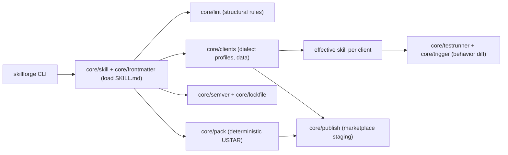

# skillforge

[English](README.md) | [中文](README.zh.md) | [日本語](README.ja.md)

[](LICENSE) [](package.json)

**An open-source, cross-client toolchain for agent skills — know where a skill works before anyone installs it.**


```bash
# skillforge is not yet on npm — install from source:
git clone https://github.com/JaydenCJ/skillforge.git
cd skillforge && npm ci && npm run build && npm link
```

## Why skillforge?

SKILL.md became an open format adopted by roughly 40 clients, and every major agent CLI now ships a skill marketplace — yet there is no packager, no test framework and no version management around it. Skill authors publish blind: the community's most common complaint is that you only find out whether a skill works after installing it. Each marketplace's publishing flow is incompatible with the others, so shipping one skill to three ecosystems means three manual processes.

|  | skillforge | mattpocock/skills (~160k★) | Marketplace built-in flows |
|---|---|---|---|
| Scaffolding | yes | no | no |
| Cross-client compat matrix | yes (3 clients) | no | no (single market) |
| Behavior tests + client diff | yes, offline | no | install-and-see |
| semver + lockfile | yes | no | no |
| Deterministic packaging | yes (byte-reproducible) | no | no |
| Publish targets | 3 (Claude Code, Codex, Gemini CLI) | 0 | 1 (own market) |

The per-client name/description budgets used by the matrix and tests are versioned data in [`src/core/clients.ts`](src/core/clients.ts) — documented values where a client publishes them, conservative estimates (as of 2026-07) where it does not. Corrections with a source link are welcome.

## Features

- **Catch breakage before install** — behavior tests run offline against each client's *effective* view of a skill (description truncated to that client's budget, unsupported fields dropped) and flag cases that diverge between clients.
- **One matrix, three verdicts** — `skillforge matrix` grades a skill compatible / partial / incompatible per client from versioned dialect profiles.
- **Deterministic by design** — no model calls: a lexical trigger scorer keeps results reproducible in CI, and `pack` output is byte-identical across runs.
- **Zero-config scaffolding** — `skillforge init` emits a lint-clean skill with frontmatter, references and a ready-to-run test suite.
- **Versioned like real software** — npm-style semver bumps plus a sha256 lockfile (`skillforge lock` / `verify`) that detects drift.
- **Three marketplaces, one source** — `skillforge publish` stages a Claude Code plugin, a Codex CLI skill directory and a Gemini CLI extension, warning on every lossy transformation.
- **Automation-friendly** — a typed TypeScript API and `--json` output for pipelines.

## Quickstart

Install (requires Node.js >= 20):

```bash
# skillforge is not yet on npm — install from source:
git clone https://github.com/JaydenCJ/skillforge.git
cd skillforge && npm ci && npm run build && npm link
```

Run the minimal example:

```bash
skillforge init pr-summarizer --script \
  -d "Summarize pull requests. Use when the user asks for a PR summary or review overview."
cd pr-summarizer
skillforge lint
skillforge matrix
skillforge test
```

Output:

```text
...
ok pr-summarizer: no issues found
compatibility matrix for pr-summarizer

client       result      errors  warnings  notes
-----------  ----------  ------  --------  ---------------------------------------------------------------------
Claude Code  compatible  0       0         reference implementation of the SKILL.md format
Codex CLI    compatible  0       0         adopts SKILL.md; no allowed-tools; shorter description budget
Gemini CLI   partial     0       1         maps to extensions (gemini-extension.json); scripts not auto-executed
...
case                                 Claude Code          Codex CLI            Gemini CLI           diff
-----------------------------------  -------------------  -------------------  -------------------  ----
triggers on a matching request       pass triggered@1.00  pass triggered@1.00  pass triggered@1.00  -
stays quiet on an unrelated request  pass silent@0.00     pass silent@0.00     pass silent@0.00     -

6 passed, 0 failed
```

The demo at the top of this page is the shipped example [`examples/commit-poet`](examples/commit-poet): its description intentionally keeps two trigger phrases past the smaller client budgets, and `skillforge test` catches the resulting divergence offline. The full walkthrough (scaffold → lint → matrix → test → version → lock → pack → publish) is scripted in [`examples/demo.sh`](examples/demo.sh) (`npm run demo`).

## Architecture



Two design decisions carry the whole tool: client profiles are *data*, so one table update propagates to lint, matrix, tests and publish warnings at once; and behavior tests score prompts against the *effective* skill each client actually sees, which turns cross-client divergence into a diffable artifact instead of a support ticket.

## Roadmap

- [x] Cross-client compatibility matrix, offline behavior diff, semver + lockfile and deterministic packaging (v0.1.0)
- [ ] `skillforge test --live`: drive real installed CLIs (`claude`, `codex`, `gemini`) and diff transcripts against the simulation
- [ ] Per-case `clients:` scoping and expected-divergence annotations in `tests/*.yaml`
- [ ] More client profiles (Cursor, Windsurf, OpenCode) as their skill support stabilizes
- [ ] JUnit/XML output and watch mode for CI
- [ ] Registry-agnostic `skillforge install <archive|url>` with lockfile verification

See the [open issues](https://github.com/JaydenCJ/skillforge/issues) for the full list.

## Contributing

Contributions are welcome — start with a [good first issue](https://github.com/JaydenCJ/skillforge/issues?q=is%3Aissue+is%3Aopen+label%3A%22good+first+issue%22) or open a [discussion](https://github.com/JaydenCJ/skillforge/discussions). Development setup and guidelines are in [CONTRIBUTING.md](CONTRIBUTING.md) — the fastest useful PR is a client-profile correction with a source link.

## License

[MIT](LICENSE)
