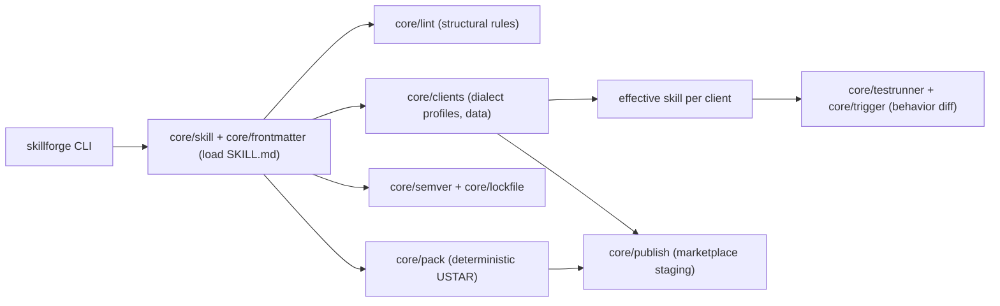

# skillforge

[English](README.md) | [中文](README.zh.md) | [日本語](README.ja.md)

[](LICENSE) [](package.json)

**开源的跨客户端 agent 技能工具链——在用户安装之前，就知道技能在哪些客户端可用。**


```bash
# skillforge 尚未发布到 npm——从源码安装：
git clone https://github.com/JaydenCJ/skillforge.git
cd skillforge && npm ci && npm run build && npm link
```

## 为什么是 skillforge？

SKILL.md 已成为约 40 个客户端采用的开放格式，各大 agent CLI 的技能市场也全部上线——但配套工具链仍是空白：没有打包器、没有测试框架、没有版本管理。技能作者只能盲发：社区最常见的抱怨是「装了才知道能不能用」。各市场的发布流程互不相通，把一个技能发到三个生态意味着三套手工流程。

|  | skillforge | mattpocock/skills (~160k★) | Marketplace built-in flows |
|---|---|---|---|
| 脚手架 | yes | no | no |
| 跨客户端兼容矩阵 | yes (3 clients) | no | no (single market) |
| 行为测试 + 客户端 diff | yes, offline | no | install-and-see |
| semver + lockfile | yes | no | no |
| 确定性打包 | yes (byte-reproducible) | no | no |
| 发布目标 | 3 (Claude Code, Codex, Gemini CLI) | 0 | 1 (own market) |

矩阵与测试所用的各客户端 name/description 预算是 [`src/core/clients.ts`](src/core/clients.ts) 中的版本化数据——客户端有公开文档的用文档值，没有的取保守估计值（截至 2026-07）。欢迎附来源链接的修正。

## 特性

- **安装前就发现破绽** —— 行为测试离线运行在每个客户端*实际看到的*技能视图上（描述按该客户端预算截断、不支持字段被丢弃），并标记客户端间结果不一致的用例。
- **一张矩阵，三个结论** —— `skillforge matrix` 基于版本化的方言档案，按客户端给出 compatible / partial / incompatible 判定。
- **从设计上就是确定性的** —— 不调用模型：词法触发打分器让结果在 CI 中可复现，`pack` 的产物每次运行字节级一致。
- **零配置脚手架** —— `skillforge init` 生成 lint 零告警的技能：frontmatter、参考资料与开箱即用的测试套件。
- **像正经软件一样管版本** —— npm 式 semver 递增，外加检测漂移的 sha256 lockfile（`skillforge lock` / `verify`）。
- **一份源码，三个市场** —— `skillforge publish` 生成 Claude Code 插件、Codex CLI 技能目录与 Gemini CLI 扩展的待发布产物，每次有损转换都有警告。
- **对自动化友好** —— 带类型的 TypeScript API 与面向流水线的 `--json` 输出。

## 快速开始

安装（需要 Node.js >= 20）：

```bash
# skillforge 尚未发布到 npm——从源码安装：
git clone https://github.com/JaydenCJ/skillforge.git
cd skillforge && npm ci && npm run build && npm link
```

运行最小示例：

```bash
skillforge init pr-summarizer --script \
  -d "Summarize pull requests. Use when the user asks for a PR summary or review overview."
cd pr-summarizer
skillforge lint
skillforge matrix
skillforge test
```

输出：

```text
...
ok pr-summarizer: no issues found
compatibility matrix for pr-summarizer

client       result      errors  warnings  notes
-----------  ----------  ------  --------  ---------------------------------------------------------------------
Claude Code  compatible  0       0         reference implementation of the SKILL.md format
Codex CLI    compatible  0       0         adopts SKILL.md; no allowed-tools; shorter description budget
Gemini CLI   partial     0       1         maps to extensions (gemini-extension.json); scripts not auto-executed
...
case                                 Claude Code          Codex CLI            Gemini CLI           diff
-----------------------------------  -------------------  -------------------  -------------------  ----
triggers on a matching request       pass triggered@1.00  pass triggered@1.00  pass triggered@1.00  -
stays quiet on an unrelated request  pass silent@0.00     pass silent@0.00     pass silent@0.00     -

6 passed, 0 failed
```

页首的 demo 就是仓库自带的示例 [`examples/commit-poet`](examples/commit-poet)：它的描述有意把两个触发短语放在较小的客户端预算之外，`skillforge test` 可以离线捕获由此产生的行为分歧。完整流程（脚手架 → lint → 矩阵 → 测试 → 版本 → 锁定 → 打包 → 发布）已写成脚本 [`examples/demo.sh`](examples/demo.sh)（`npm run demo`）。

## 架构



支撑整个工具的两个设计决策：客户端档案是*数据*，改一张表就能同时更新 lint、矩阵、测试与发布警告；行为测试打分的对象是每个客户端*实际看到的*有效技能，从而把跨客户端分歧变成可 diff 的工件，而不是一张用户工单。

## 路线图

- [x] 跨客户端兼容矩阵、离线行为 diff、semver + lockfile 与确定性打包（v0.1.0）
- [ ] `skillforge test --live`：驱动真实安装的 CLI（`claude`、`codex`、`gemini`），将实际会话与模拟结果做 diff
- [ ] `tests/*.yaml` 支持用例级 `clients:` 作用域与「预期分歧」标注
- [ ] 更多客户端档案（Cursor、Windsurf、OpenCode），随其技能支持稳定而加入
- [ ] 面向 CI 的 JUnit/XML 输出与 watch 模式
- [ ] 与注册表无关的 `skillforge install <archive|url>`（带 lockfile 校验）

完整列表见 [open issues](https://github.com/JaydenCJ/skillforge/issues)。

## 参与贡献

欢迎贡献——从 [good first issue](https://github.com/JaydenCJ/skillforge/issues?q=is%3Aissue+is%3Aopen+label%3A%22good+first+issue%22) 入手，或到 [Discussions](https://github.com/JaydenCJ/skillforge/discussions) 发起讨论。开发环境与规范见 [CONTRIBUTING.md](CONTRIBUTING.md)——最快见效的 PR 是附来源链接的客户端档案修正。

## 许可证

[MIT](LICENSE)
